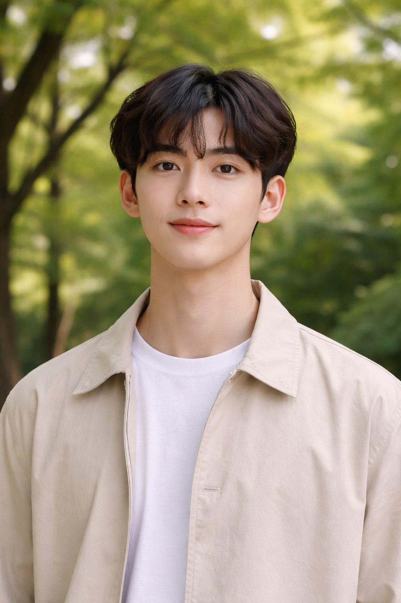
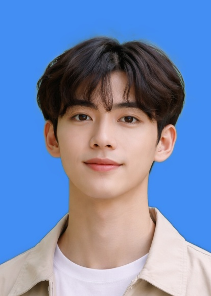
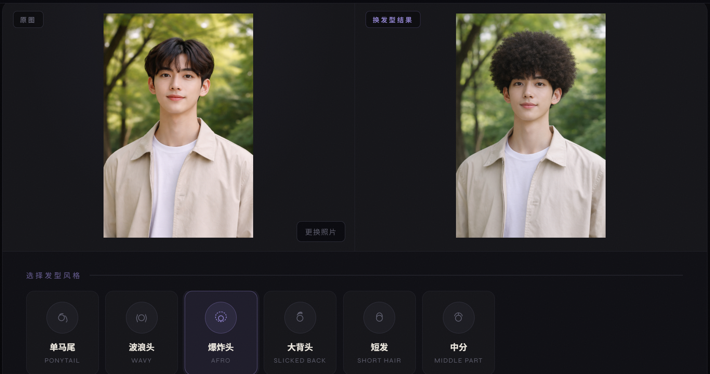

# VISAGE — AI ID Photo & Hairstyle Studio

An AI-powered portrait tool built on [HivisionIDPhotos](https://github.com/Zeyi-Lin/HivisionIDPhotos), offering two core features: professional ID photo generation and AI hairstyle transformation.

> **Note:** The AWS EC2 backend is currently **stopped** to avoid incurring additional cloud costs. To run the ID photo feature, deploy the backend locally or restart the EC2 instance (see [Running the Backend](#5-run-the-backend) below).

---

## Demo

### Original Photo


### ID Photo Result


### AI Hairstyle Before & After


---

## Features

- **ID Photo Generation** — AI-powered portrait matting, 14 standard sizes, custom background color, 4 matting models
- **AI Hairstyle** — 6 hairstyle styles (ponytail, wavy, afro, slicked-back, short, middle part), powered by GPT-Image via Poe Embed API, before/after comparison view
- Backend deployed on **AWS EC2** with nginx reverse proxy (HTTPS); frontend calls the public API directly

---

## Project Structure

```
ID_Photo/
├── code/
│   ├── Backend/        # FastAPI backend (ID photo API)
│   └── Frontend/       # Single-file HTML frontend
├── EC2/                # Deployment package for AWS EC2
└── backup/             # Reference files
```

---

## Getting Started

### 1. Clone the Repository

```bash
git clone https://github.com/Fly-cpu-source/ID_Photo.git
cd ID_Photo
```

### 2. Create a Virtual Environment

```bash
# Windows
python -m venv .venv
.venv\Scripts\activate

# Mac / Linux
python -m venv .venv
source .venv/bin/activate
```

### 3. Install Dependencies

```bash
pip install -r code/Backend/requirements.txt
```

Key dependencies: `fastapi`, `uvicorn`, `opencv-python`, `onnxruntime`, `numpy`, `pillow`, `python-multipart`

### 4. Download Model Weights

Model files are not included in this repository (too large). Download them manually and place in the correct directories.

**Directory: `code/Backend/hivision/creator/weights/`**

| File | Description |
|------|-------------|
| `hivision_modnet.onnx` | Lightweight matting model |
| `modnet_photographic_portrait_matting.onnx` | High-quality matting model (recommended default) |
| `birefnet-v1-lite.onnx` | BiRefNet matting model |
| `rmbg-1.4.onnx` | RMBG background removal model |

**Directory: `code/Backend/hivision/creator/retinaface/weights/`**

| File | Description |
|------|-------------|
| `retinaface-resnet50.onnx` | Face detection model |

> Download from the [HivisionIDPhotos official releases](https://github.com/Zeyi-Lin/HivisionIDPhotos).

### 5. Run the Backend

**Locally:**
```bash
cd code/Backend
uvicorn main:app --host 0.0.0.0 --port 8000
```

**On AWS EC2** (nginx reverse proxy, HTTPS on port 443):
```bash
cd ~/app
source .venv/bin/activate
nohup uvicorn main:app --host 127.0.0.1 --port 8000 &
sudo systemctl start nginx
```

> If running locally, update `API_BASE` in `code/Frontend/index.html` from `https://3.133.83.15` to `http://localhost:8000`.

### 6. Open the Frontend

Open `code/Frontend/index.html` directly in a browser.

> **Note:** The AI Hairstyle feature requires the page to be embedded inside **Poe** (depends on Poe Embed API + GPT-Image-1.5). It will not work when opening the HTML file directly.

---

## API Reference

### POST `/api/generate`

Generate an ID photo.

| Parameter | Type | Default | Description |
|-----------|------|---------|-------------|
| `image` | file | — | Portrait image to process |
| `bg_color` | string | `#FFFFFF` | Background color (hex) |
| `height` | int | `413` | Output height in pixels |
| `width` | int | `295` | Output width in pixels |
| `matting_model` | string | `modnet_photographic_portrait_matting` | Matting model to use |

**Available matting models:**

| Value | Description |
|-------|-------------|
| `modnet_photographic_portrait_matting` | MODNet photographic (default) |
| `hivision_modnet` | HivisionModNet, optimized for ID photos |
| `birefnet-v1-lite` | BiRefNet Lite, fine edge detail |
| `rmbg-1.4` | RMBG 1.4, background removal |

**Response:** `{ "image": "<base64 JPEG>" }`

---

## FAQ

**Q: "No face detected" error**
A: Upload a clear, front-facing portrait. Avoid side profiles, obstructions, or blurry images.

**Q: Model loading error**
A: Verify that all `.onnx` files are placed in the correct directories with exact filenames.

**Q: pip install fails**
A: Ensure Python >= 3.9 and use a virtual environment.

**Q: AI Hairstyle feature not working**
A: This feature requires the Poe Embed API. It only works when the page is embedded inside a Poe bot — not when opened as a local file.

**Q: Frontend cannot connect to backend**
A: The frontend points to `https://3.133.83.15` (AWS EC2). If the EC2 instance is stopped, run the backend locally and update `API_BASE` in `index.html` to `http://localhost:8000`. On first visit to the EC2 HTTPS endpoint, the browser may show a certificate warning — click "Advanced" and proceed to trust the self-signed certificate.
